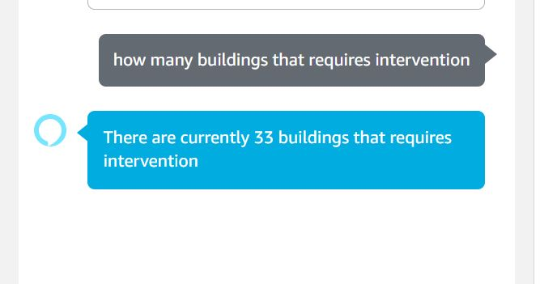
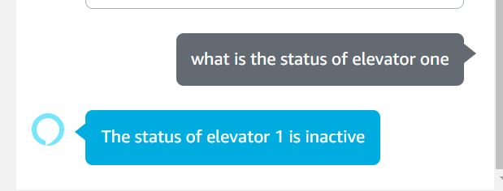
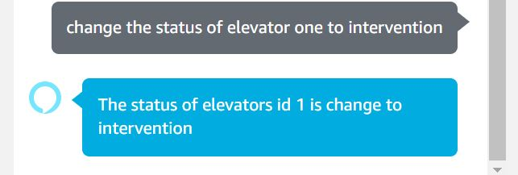
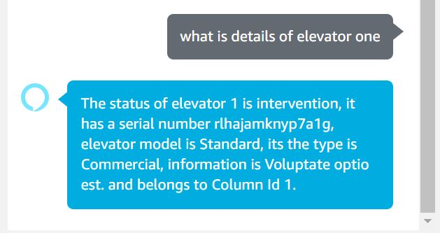
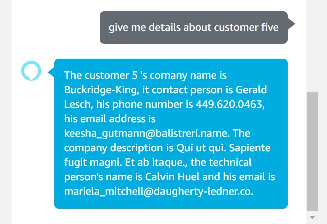
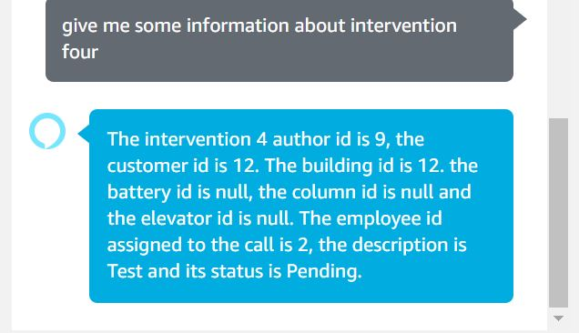

# RocketElevators-AI-Alexa 
-----------------------------------------------------------------------------------------------

## CodeBoxx Odissey - Week 13 - Artificial Intelligence as a Service


-----------------------------------------------------------------------------------------------

# Team:

```ssh
- Eric Turcotte
- Claude St-Laurent
- Cristiane Santiago
- Felix Masse
- Ines Josiane
- Tommy Côté
```
-----------------------------------------------------------------------------------------------

[URL for Rest API:  https://rocket-elevators-ai.azurewebsites.net](https://rocket-elevators-ai.azurewebsites.net)

[Click here to see the presentation video](https://www.dropbox.com/sh/ylura897kseqzde/AADKbwicikAQ3dpWLhPhSPYaa?dl=0)


-----------------------------------------------------------------------------------------------

[Click here to see the repository for the Rest API](https://github.com/cris-s-santiago/Rocket-Elevators-AI-Alexa-Rest-API.git)

-----------------------------------------------------------------------------------------------

🚀 At Rocket Elevators a new project has been funded to improve accessibility to information and artificial intelligence is seen as a tool to improve access to key functionality.

Get information on the status of Rocket Elevators operations via Alexa and Amazon Echo technologies.

📈 For this, we use Alexa Skills, it let customers use their voices to perform everyday tasks like checking the news, listening to music, playing a game, and more.


📌 For started:
Invocation:

              rocket elevators system


Ask a little briefing about Rocket Elevators

              "what is the rocket elevators situation",
              "How is it going at Rocket Elevators",
              "What is new at rocket elevators",
              "What is happening at Rocket Elevators",
              "A briefing please",
              "Tell me about the company",
              "Tell me what is going on at Rocket Elevators",
              "Tell me what is up at Rocket Elevators",

here is a response From Alexa


Ask a list of Builds require intervention

              "how many buildings that require intervention",
              "buildings with intervention"
              
here is a response From Alexa



Ask the status of an elevator (id can be between 1-231)

              "What is the status of elevator {id}",
              "What is the elevator {id} status",
              "What's the status of elevator {id}",
              "What's the elevator {id} status",
              "Tell me the status of elevator {id}",
              "Tell me the elevator {id} status",
              "Can you tell me the status of elevator {id}",
              "Give me the status about elevator {id}"
here is a response From Alexa

Change elevator Status (id can be between 1-231)

              "Change elevator {id} status to {status}",
              "Change the status of elevator {id} to {status}",
              "Change status to {status} for elevator {id}"
here is a response From Alexa

 

Ask details of an elevator (id can be between 1-231)

              "What is the details of elevator {id}",
              "What is the elevator {id} details",
              "What's the details of elevator {id}",
              "What's the elevator {id} details",
              "Tell me the details of elevator {id}",
              "Tell me the elevator {id} details",
              "Can you tell me the details of elevator {id}",
              "Give me details about elevator {id}"
here is a response From Alexa

             

Ask details of any particular Customer (id can be between 1-50)

              "What is the details of customer {id}",
              "Give me details about customer {id}",
              "What is the information of customer {id}",
              "What is the customer {id} information",
              "What's the information of customer {id}",
              "What's the customer {id} information",
here is a response From Alexa

 

Ask the status of an Column (id can be between 1-115)

              "What is the status of column {id}",
              "What is the column {id} status",
              "What's the status of column {id}",
              "What's the column {id} status",
              "Tell me the status of column {id}",
              "Tell me the column {id} status",
              "Can you tell me the status of column {id}",
              "Give me the status about column {id}"
Change Column Status (id can be between 1-115)

               "Change column {id} status to {status}",
               "Change the status of column {id} to {status}",
               "Change status to {status} for column {id}"

here is a response From Alexa
 

Ask details of any particular Intervention (id can be between 1-5)
                  
                "What is the details of intervention {id}",
                "Give me some information about intervention {id}",
                "What is the information of intervention {id}",
                "What is the intervention {id} information",
                "What's the information of intervention {id}"
here is a response From Alexa

 

Ask the status of a particular Intervention (id can be between 1-5)
                  
                "What is the status of intervention {id}",
                "What is the intervention {id} status",
                "What's the status of intervention {id}",
                "What's the intervention {id} status",
                "Tell me the status of intervention {id}",
Change Intervention Status to Inprogress (id can be between 1-5)

                "Can you change intervention {id} to the status in progress",
                "Change the status in progress for the intervention id {id}"

Change Intervention Status to Completed (id can be between 1-5)

               "Can you change intervention {id} to the status completed",
               "Change the status completed for the intervention id {id}"
here is a response From Alexa

 
               
# Reference:

📚 https://dabblelab.com/templates/2-alexa-remote-api-example-skill

📚 https://developer.amazon.com/en-US/alexa/alexa-skills-kit


-----------------------------------------------------------------------------------------------


-----------------------------------------------------------------------------------------------
